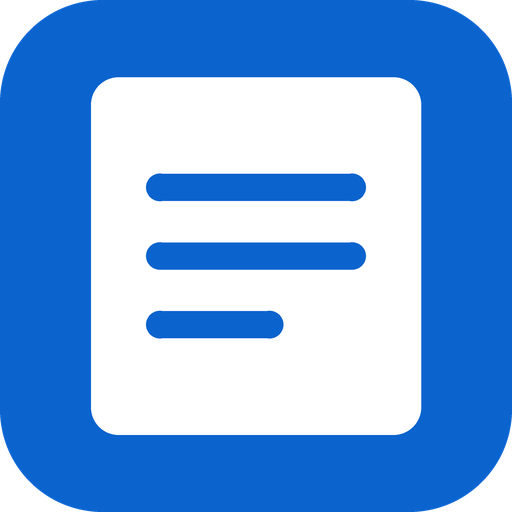

<!--
SPDX-FileCopyrightText: 2026 UltimateNotes contributors
SPDX-License-Identifier: GPL-3.0-or-later
-->

<div align="center">



# UltimateNotes

**Your Nextcloud Notes, the Apple Notes way, offline first.**

[](https://github.com/qtekfun/UltimateNotes/actions/workflows/ci.yml)
[](LICENSE)
[](#requirements)

[](https://github.com/qtekfun/UltimateNotes/releases)
<!-- The F-Droid badge goes next to this one once the app is published there. -->

</div>

A modern, offline-first Android client for [Nextcloud Notes](https://apps.nextcloud.com/apps/notes): folders, a chronological list with previews, a WYSIWYG editor that saves plain Markdown, checklists and search. It keeps working without a connection and syncs when it can.

Free software (GPL-3.0-or-later), with no Google services, no ads and no telemetry. Built for [F-Droid](https://f-droid.org).

> Status: pre-release. There are no screenshots yet; they will be added to `fastlane/metadata/android/*/images/phoneScreenshots` once captured on a device.

## Features

- **Offline first**: notes live on the device; every change is saved at once and synced later through a queue that survives restarts.
- **Sync with Nextcloud Notes** (API v1): on open, on save, periodic and manual. If a note changed on both sides, no text is lost: the server keeps the original and your version becomes a copy.
- **Folders and subfolders**, favorites on top, a list grouped by date with a preview of each note.
- **WYSIWYG Markdown editor**: headings, bold, italic, strikethrough, lists, quotes, links and inline code. Syntax it does not support (tables, HTML...) is kept untouched.
- **Interactive checklists** (`- [ ]` / `- [x]`).
- **Offline full-text search** over titles and bodies.
- **Home screen widget** with recent and favorite notes.
- **Biometric lock**.
- **Export** a note as Markdown or PDF.
- **Encrypted backup** of settings and account (notes live on your server).
- Light, dark and pure black (AMOLED) themes, Material You colors, English and Spanish.
- **Secure**: HTTPS only, app password from Nextcloud's Login Flow v2 encrypted with the Android Keystore.

It needs a Nextcloud server with the **Notes** app installed. Not included: reminders, tags, note colors, attachments, sharing or several accounts (Nextcloud Notes cannot store them).

## Install

- **F-Droid**: not published yet. This section will link to it once the app is accepted.
- **GitHub Releases**: download the signed APK from [Releases](https://github.com/qtekfun/UltimateNotes/releases). Release candidates (`-rc.N`) are marked as pre-releases and are not offered on F-Droid. The APK is signed with the project's own key and the build is reproducible, so updating between GitHub and F-Droid works.

## Requirements

Android 8.0 (API 26) or newer, and a Nextcloud server with the Notes app.

## Build

JDK 21 and the Android SDK are needed.

```sh
./gradlew assembleDebug      # debug APK in app/build/outputs/apk/debug
./gradlew check              # unit tests, detekt, ktlint, Android Lint and Kover
./scripts/verify-reproducible.sh   # builds the release APK twice and compares hashes
```

Release and F-Droid steps are in [`RELEASING.md`](RELEASING.md).

## Documentation

- [`PRIVACY.md`](PRIVACY.md): what data goes where.
- [`SPEC.md`](SPEC.md): what the app does. [`PLAN.md`](PLAN.md): the order it is built in.
- [`CONTRIBUTING.md`](CONTRIBUTING.md), [`CHANGELOG.md`](CHANGELOG.md), [`CLAUDE.md`](CLAUDE.md).

## Sister apps

[UltimateTasks](https://github.com/qtekfun/UltimateTasks) (Nextcloud Tasks) and [UltimateDeck](https://github.com/qtekfun/UltimateDeck) (Nextcloud Deck), built the same way.

## En español

Cliente de notas moderno para **Nextcloud Notes**, con la experiencia de Apple Notes y sin conexión primero: carpetas, editor WYSIWYG que guarda Markdown, checklists, favoritas, búsqueda sin conexión, widget, bloqueo biométrico, exportación a Markdown y PDF y copia de seguridad cifrada. Software libre (GPL-3.0-or-later), sin servicios de Google, sin anuncios y sin telemetría.

- **Instalar**: F-Droid cuando se publique; mientras tanto, el APK firmado de [GitHub Releases](https://github.com/qtekfun/UltimateNotes/releases).
- **Requisitos**: Android 8.0 o superior y un servidor Nextcloud con la app Notes.
- **Compilar**: `./gradlew assembleDebug` y `./gradlew check` (JDK 21 y Android SDK).
- Documentación: [`PRIVACY.md`](PRIVACY.md), [`SPEC.md`](SPEC.md), [`PLAN.md`](PLAN.md).
